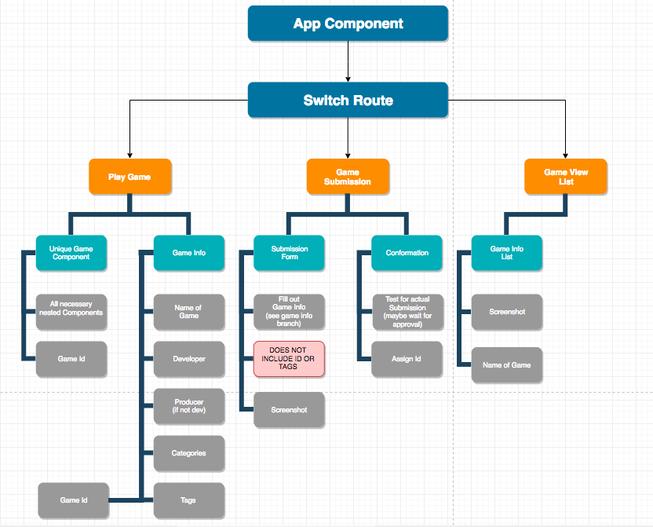

# React Game Host

_Site to link to other sites, made with React._

### Developed By
J. Michael Brown

## Table of contents
**[Description](#description)**    
**[Setup & Installation](#setup-and-installation)**    
**[Known Bugs](#known-bugs)**    
**[Support](#support-and-contact-details)**    
**[Technologies Used](#technologies-used)**    
**[License](#license)**    
**[Copyright](#copyright)**   
**[Dev Notes](#developer-notes)**   
**[Component Structure](#component-structure)**   
**[Project Proposal](#project-proposal)**

## Description

A user should be view a list of any of several windows provided with the site. The user may navigate to a page containing an iframe for that site. They should should be able to suggest a tag for that piece of content. If you use an admin/user upload feature you may add several categories to your content from a predetermined list, and you should be able to manually write in extra tags (like a category, but not significant enough to be on the list) for your piece of content. A user should be able to filter content on display by category, or search by key words to only display content with those in its title and/or tags.

## Setup and Installation
Here are some links in case you need information about setup for other operating systems:  
[Node JS](https://nodejs.org/en/);

(If you cannot install node you still need to install Git's [Homebrew](https://brew.sh/) on your device)

## Known Bugs

* {List of all Bugs}

## Support and contact details
_If you run into any issues or have questions, ideas or concerns, or if you want to make a contribution to the code. You can email me_

Michael Brown :: [jmichaelbrown132737@gmail.com](jmichaelbrown132737@gmail.com)

## Technologies Used
(This wonderful table was lovingly pilfered from [Tanvi Garg](https://github.com/TanviCodeLife) and modestly edited for personal sensibilities.)

For versions and a full list of dependencies, plugins, and scripts see the "devDependencies" section in [package.json](./package.json).  

| Dependency | Description |
| --- | --- |
| css-loader| compiler plugin to load css files |
| style-loader| compiler plugin to use custom style sheets |
| react | REACT core plugin |
| react-router-dom | REACT web routing plugin |
| babel-core | Babel compiler core |
| babel-loaded | Babel loader for webpack |
| babel-present-es2015 | Specifies how Babel can convert ES6 to ES5 |
| eslint | Identifies and reports on patterns found in Javscript code |
| eslint-loader | ESLint loader for webpack |
| html-webpack-plugin | Simplifies creation of HTML files to serve webpack bundles |
| webpack | A module bundler used to bundle JavaScript files and additional resources   *Note - Remove carrot sign ^ in version number if webpack issues occur* |
| webpack-cli | Use webpack from command line |
| webpack-dev-server | Provides live reloading during development |

### License

MIT License

Copyright (c) 2018, ___J. Michael Brown___  

Permission is hereby granted, free of charge, to any person obtaining a copy
of this software and associated documentation files (the "Software"), to deal
in the Software without restriction, including without limitation the rights
to use, copy, modify, merge, publish, distribute, sublicense, and/or sell
copies of the Software, and to permit persons to whom the Software is
furnished to do so, subject to the following conditions:  

The above copyright notice and this permission notice shall be included in all
copies or substantial portions of the Software.

THE SOFTWARE IS PROVIDED "AS IS", WITHOUT WARRANTY OF ANY KIND, EXPRESS OR
IMPLIED, INCLUDING BUT NOT LIMITED TO THE WARRANTIES OF MERCHANTABILITY,
FITNESS FOR A PARTICULAR PURPOSE AND NONINFRINGEMENT. IN NO EVENT SHALL THE
AUTHORS OR COPYRIGHT HOLDERS BE LIABLE FOR ANY CLAIM, DAMAGES OR OTHER
LIABILITY, WHETHER IN AN ACTION OF CONTRACT, TORT OR OTHERWISE, ARISING FROM,
OUT OF OR IN CONNECTION WITH THE SOFTWARE OR THE USE OR OTHER DEALINGS IN THE
SOFTWARE.

## Developer Notes    
README.md template provided by [Ralph Perdomo](https://github.com/pseudoralph)

{Additional links to plug helpful information}

[See in depth Dev Notes](./DEV_NOTES.md)

## Component Structure

## Project Proposal:

#### Project’s Purpose or Goal:
Allow users to choose from a list of React Component/ flash games to play

#### List of the absolute minimum features the project requires to meet this purpose or goal:

* display a list of available games
unique routes for each
* have requirement form to upload new flash game/ Game component

#### What tools, frameworks, libraries, APIs, modules and/or other resources (whatever is specific to your track, and your language) will I use to create this MVP?

* react
* react-router
* at least one pure logic third party component that contains a playable game (no dependencies for testing purposes)
search feature to find specific games (by name)

#### If I finish developing the minimum viable product (MVP) with time to spare, what will I work on next?

* add ability to play flash games
* include dependancies for component games (component libraries)
* add categories: I the site host, and the game uploader may add categories to a game - keywords for searching so others may find the game that fits what they are looking for more easily (set hard limit). i.e. 'platformer' or 'adventure' (a common genre)
* add tags: users may suggest 'tags' for a game, so that a game may adopt more search terms to be associated with a game. i.e. 'metroidvania' (a popular description made up by a gaming community)

#### What additional tools, frameworks, libraries, APIs, or other resources will these additional features require?

* flash loader
* mp3 file loader
* Materialize - for additional design
* either a pluggin loader, or links to deployed sites (loaded within an i-frame)

#### Other things I'd like you to know:

MVP will use a Component with no additional libraries to be loaded (I'll just refactor the intro group week project into a single component over the weekend - minimal work necessary). I haven't messed with flash before, from what I've heard it probably isn't to hard to implement. I'll focus on hitting MVP then UI/UX design, then adding additional features.
